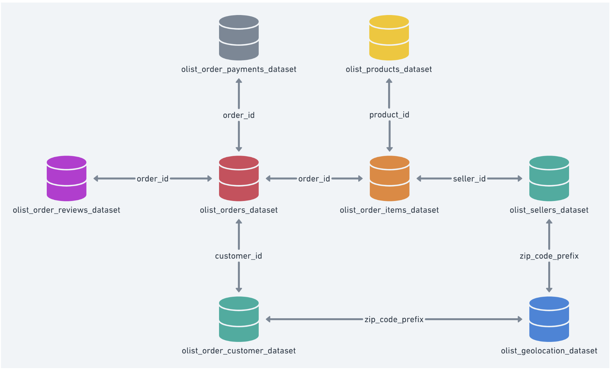

# Production Data Warehouse for Olist E-commerce


Source: [https://www.kaggle.com/datasets/olistbr/brazilian-ecommerce](https://www.kaggle.com/datasets/olistbr/brazilian-ecommerce)

## Prerequisites

- **Conda**: Miniconda or Anaconda installed.
- **Google Cloud Platform**: A valid GCP project with BigQuery enabled, and a Service Account with `BigQuery Data Editor` and `BigQuery Job User` roles.

---

## 1. Environment Setup

```bash
conda env create -f environment.yml
conda activate ntu-project-2
```

Create a `.env` file and replace the placeholders:
```
GCP_PROJECT_ID=<gcp project id>
GCP_CREDENTIALS_PATH=<absolute path to json file>
```

Modify the following files with your own values:
- `elt/meltano.yml`
- `dbt_project/profiles.yml`

---

## 2. Pipeline Overview

Each tool owns a distinct layer. Run them in order — the pipeline stops automatically if any stage fails:

```
[1] Great Expectations   validate source CSVs   (data/)
[2] Meltano              extract & load          (data/ → BigQuery raw_olist)
[3] dbt                  transform               (raw_olist → stg_olist → analytics)
[4] dbt test             validate transforms     (BigQuery)
```

For convenience, `run_pipeline.sh` at the project root chains all four stages:
```bash
./run_pipeline.sh
```

---

## 3. Data Validation (Great Expectations)

Runs **before** loading to catch schema issues, out-of-range values, and invalid categories in the raw CSVs.

```bash
python great_expectations/validate.py
```

Exit codes: `0` = all passed, `1` = one or more failed. Fix source data before proceeding to ingestion.

**What is validated:**

| Dataset | Expectations |
|---|---|
| order_items | not-null keys/price/freight, price ≥ 0 |
| order_payments | not-null, valid payment_type enum, value ≥ 0 |
| orders | not-null, unique order_id, valid order_status enum |
| order_reviews | not-null, review_score between 1–5 |
| customers | not-null customer_id, customer_unique_id |
| products | not-null product_id, product_category_name |
| sellers | not-null seller_id |

---

## 4. Data Ingestion (Meltano)

Moves validated CSV data from `data/` into BigQuery (`raw_olist` dataset).

**Setup** (first time only):
```bash
cd elt
meltano install --plugin-type loader target-bigquery
```

**Run**:
```bash
cd elt
meltano elt tap-csv target-bigquery
```

**Force re-load** (if a previous run was interrupted):
```bash
cd elt
meltano elt tap-csv target-bigquery --force
```

---

## 5. Data Warehouse Design

### Star Schema Overview

The data is transformed into a star schema in BigQuery using dbt. Three layers:

- **Staging** (`stg_olist`): Light cleaning — type casts, basic standardisation
- **Core** (`stg_olist`): Business-level joins and transformations
- **Analytics** (`analytics`): Star schema dimensions and facts

**3 Fact Tables + 7 Dimension Tables:**

| Table | Type | Grain | Approx Rows |
|---|---|---|---|
| `fct_orders` | Fact | 1 row per order | ~99K |
| `fct_order_items` | Fact | 1 row per line item | ~112K |
| `fct_product_reviews` | Fact | 1 row per review | ~99K |
| `dim_date` | Dimension (Type 0) | 1 row per day | ~3,650 |
| `dim_geography` | Dimension (Type 0) | 1 row per zip | ~1,345 |
| `dim_payment_type` | Dimension (Type 0) | 1 row per method | 5 |
| `dim_product_category` | Dimension (SCD2) | 1 row per category | ~72 |
| `dim_products` | Dimension (SCD1) | 1 row per product | ~32K |
| `dim_customers` | Dimension (SCD2) | 1 row per customer | ~100K |
| `dim_sellers` | Dimension (SCD1) | 1 row per seller | ~3.6K |

### Schema ER Diagram

```
                          ┌─────────────────┐
                          │   dim_date      │
                          │─────────────────│
                          │ date_key (PK)   │
                          │ calendar_date   │
                          │ year/quarter/   │
                          │ month/week ...  │
                          └────────┬────────┘
                                   │ purchase_date_key
                                   │ approval_date_key
                                   │ delivery_date_key
           ┌───────────────────────┼───────────────────────┐
           │                       │                       │
┌──────────▼──────────┐  ┌─────────▼──────────┐  ┌────────▼────────────┐
│   fct_orders        │  │  fct_order_items   │  │ fct_product_reviews │
│─────────────────────│  │────────────────────│  │─────────────────────│
│ order_key (PK)      │  │ order_item_key (PK)│  │ review_key (PK)     │
│ order_id            │  │ order_id           │  │ review_id           │
│ customer_key (FK)───┼──┼────────────────────┼──┼─► dim_customers     │
│ purchase_date_key   │  │ product_key (FK)───┼──┼─► dim_products      │
│ customer_geo_key    │  │ seller_key (FK)    │  │ review_date_key     │
│ payment_type_key    │  │ seller_geo_key     │  │ review_score        │
│ total_revenue       │  │ price              │  │ review_sentiment    │
│ total_freight       │  │ freight_value      │  │ has_comment         │
│ delivery_days       │  │ total_item_value   │  └─────────────────────┘
│ is_on_time          │  └────────────────────┘
└─────────────────────┘

Shared dimension lookups:
  customer_key     ──► dim_customers        ──► dim_geography (via geography_key)
  product_key      ──► dim_products         ──► dim_product_category (via category_key)
  seller_key       ──► dim_sellers          ──► dim_geography (via geography_key)
  *_geo_key        ──► dim_geography        (conformed)
  date_key         ──► dim_date             (conformed)
  payment_type_key ──► dim_payment_type
```

### Dimension Tables

#### dim_date — SCD Type 0 (Static)

Conformed — shared across all fact tables. Surrogate key: `date_key` (INT64, YYYYMMDD).

| Column | Type | Description |
|---|---|---|
| `date_key` | INT64 | e.g. 20231201 |
| `calendar_date` | DATE | |
| `year` | INT64 | |
| `quarter` | INT64 | 1–4 |
| `month` | INT64 | 1–12 |
| `day_of_month` | INT64 | 1–31 |
| `day_of_week` | INT64 | 1=Monday, 7=Sunday |
| `week_of_year` | INT64 | ISO week |
| `day_name` | STRING | e.g. Monday |
| `month_name` | STRING | e.g. January |
| `is_weekend` | BOOLEAN | |
| `is_holiday` | BOOLEAN | Brazil public holidays (TODO) |
| `days_since_epoch` | INT64 | Days since 1970-01-01 |

Coverage: 5 years back, 5 years forward from current date.

#### dim_customers — SCD Type 2

Tracks customer address changes over time. Surrogate key: `customer_key` (INT64). Natural keys: `customer_unique_id` (stable business key), `customer_id` (per-order transactional key).

| Column | Type | Description |
|---|---|---|
| `customer_key` | INT64 | Surrogate PK |
| `customer_unique_id` | STRING | Stable business key |
| `customer_id` | STRING | Per-order transactional key |
| `customer_zip_code` | INT64 | |
| `customer_city` | STRING | |
| `customer_state` | STRING | 2-letter BR state code |
| `geography_key` | INT64 | FK → dim_geography |
| `valid_from_date` | TIMESTAMP | SCD Type 2 start |
| `valid_to_date` | TIMESTAMP | SCD Type 2 end (NULL = current) |
| `is_current` | BOOLEAN | TRUE for active record |

#### dim_products — SCD Type 1

Surrogate key: `product_key` (INT64). Natural key: `product_id`.

| Column | Type | Description |
|---|---|---|
| `product_key` | INT64 | Surrogate PK |
| `product_id` | STRING | Natural key |
| `product_category_name` | STRING | Portuguese category name |
| `category_key` | INT64 | FK → dim_product_category |
| `product_name_length` | INT64 | Character count |
| `product_description_length` | INT64 | Character count |
| `product_photos_qty` | INT64 | |
| `product_weight_g` | INT64 | |
| `product_length_cm` | INT64 | |
| `product_height_cm` | INT64 | |
| `product_width_cm` | INT64 | |
| `product_volume_cm3` | INT64 | Derived: length × height × width |

#### dim_sellers — SCD Type 1

Surrogate key: `seller_key` (INT64). Natural key: `seller_id`.

| Column | Type | Description |
|---|---|---|
| `seller_key` | INT64 | Surrogate PK |
| `seller_id` | STRING | Natural key |
| `seller_zip_code` | INT64 | |
| `seller_city` | STRING | |
| `seller_state` | STRING | 2-letter BR state code |
| `geography_key` | INT64 | FK → dim_geography |

#### dim_geography — SCD Type 0 (Static, Conformed)

Conformed — used by dim_customers, dim_sellers, and directly by fct_orders / fct_order_items. Surrogate key: `location_key` (INT64). Natural key: `zip_code_prefix` + `state`.

| Column | Type | Description |
|---|---|---|
| `location_key` | INT64 | Surrogate PK |
| `zip_code_prefix` | STRING | 5-digit Brazilian postal prefix |
| `city` | STRING | |
| `state` | STRING | 2-letter BR state code |
| `region` | STRING | North / Northeast / West / Southeast / South |
| `latitude` | FLOAT64 | |
| `longitude` | FLOAT64 | |
| `regional_sales_tier` | STRING | TODO: populate from aggregated sales |

#### dim_payment_type — SCD Type 0 (Static)

Surrogate key: `payment_type_key` (INT64). Natural key: `payment_type_name`.

| Column | Type | Description |
|---|---|---|
| `payment_type_key` | INT64 | Surrogate PK |
| `payment_type_name` | STRING | credit_card / debit_card / boleto / voucher / not_defined |
| `payment_channel` | STRING | online / offline / other |
| `requires_installments` | BOOLEAN | TRUE for credit_card only |
| `payment_risk_level` | STRING | low / medium / high / unknown |

#### dim_product_category — SCD Type 2

Tracks category reclassification over time. Surrogate key: `category_key` (INT64). Natural key: `category_name` (Portuguese).

| Column | Type | Description |
|---|---|---|
| `category_key` | INT64 | Surrogate PK |
| `category_name` | STRING | Portuguese name (natural key) |
| `category_name_english` | STRING | English translation |
| `category_type` | STRING | Electronics / Fashion / Home / Health & Beauty / Other |
| `valid_from_date` | TIMESTAMP | SCD Type 2 start |
| `valid_to_date` | TIMESTAMP | SCD Type 2 end (NULL = current) |
| `is_current` | BOOLEAN | TRUE for active record |

### Fact Tables

#### fct_orders — Grain: One row per order

| Column | Type | Kind | Description |
|---|---|---|---|
| `order_key` | STRING | Surrogate PK | MD5 of `order_id` |
| `order_id` | STRING | Degenerate dim | Natural key from source |
| `customer_key` | INT64 | FK → dim_customers | |
| `purchase_date_key` | INT64 | FK → dim_date | When order was placed (YYYYMMDD) |
| `approval_date_key` | INT64 | FK → dim_date | When order was approved |
| `carrier_date_key` | INT64 | FK → dim_date | When handed to carrier |
| `delivery_date_key` | INT64 | FK → dim_date | Actual delivery date |
| `estimated_delivery_date_key` | INT64 | FK → dim_date | Estimated delivery date |
| `customer_geography_key` | INT64 | FK → dim_geography | Customer zip location |
| `payment_type_key` | INT64 | FK → dim_payment_type | Primary payment method |
| `order_status` | STRING | Degenerate dim | delivered / shipped / canceled … |
| `order_item_count` | INT64 | Measure | Number of line items |
| `total_revenue` | FLOAT64 | Measure (additive) | SUM(price) across items |
| `total_freight` | FLOAT64 | Measure (additive) | SUM(freight_value) across items |
| `total_payment_value` | FLOAT64 | Measure (additive) | SUM(payment_value) from order_payments |
| `max_payment_installments` | INT64 | Measure | MAX(payment_installments) |
| `delivery_days` | INT64 | Derived measure | DATE_DIFF(delivered, purchased, DAY) |
| `approval_days` | INT64 | Derived measure | DATE_DIFF(approved, purchased, DAY) |
| `is_delivered` | BOOLEAN | Derived flag | order_status = 'delivered' |
| `is_on_time` | BOOLEAN | Derived flag | delivered_date <= estimated_date |

#### fct_order_items — Grain: One row per line item

| Column | Type | Kind | Description |
|---|---|---|---|
| `order_item_key` | STRING | Surrogate PK | MD5 of order_id \|\| order_item_id |
| `order_id` | STRING | Degenerate dim | Links to fct_orders |
| `order_item_id` | INT64 | Degenerate dim | Position within order |
| `product_key` | INT64 | FK → dim_products | |
| `seller_key` | INT64 | FK → dim_sellers | |
| `seller_geography_key` | INT64 | FK → dim_geography | Seller zip location |
| `purchase_date_key` | INT64 | FK → dim_date | Order purchase date |
| `shipping_date_key` | INT64 | FK → dim_date | Shipping limit date |
| `price` | FLOAT64 | Measure (additive) | Item sale price |
| `freight_value` | FLOAT64 | Measure (additive) | Freight charged |
| `total_item_value` | FLOAT64 | Derived measure | price + freight_value |

#### fct_product_reviews — Grain: One row per review

| Column | Type | Kind | Description |
|---|---|---|---|
| `review_key` | STRING | Surrogate PK | MD5 of review_id |
| `review_id` | STRING | Degenerate dim | Natural key |
| `order_id` | STRING | Degenerate dim | Links to fct_orders |
| `customer_key` | INT64 | FK → dim_customers | Reviewer |
| `product_key` | INT64 | FK → dim_products | Reviewed product |
| `review_date_key` | INT64 | FK → dim_date | Review creation date |
| `review_score` | INT64 | Measure | 1–5 star rating |
| `review_sentiment` | STRING | Derived | positive (≥4) / neutral (3) / negative (≤2) |
| `has_comment` | BOOLEAN | Derived flag | review_comment_message IS NOT NULL |

### Key Design Decisions

**Surrogate Keys** — All dimensions carry an INT64 surrogate key; natural keys are preserved as degenerate dimensions in facts. Enables efficient joins and SCD tracking.

**Conformed Dimensions** — `dim_date` and `dim_geography` are shared across all fact tables without modification. Ensures consistent time-based comparisons and geographic analysis.

**Grain Declaration** — Each fact table has an explicit grain. `fct_orders` = 1 row per order; `fct_order_items` = 1 row per line item; `fct_product_reviews` = 1 row per review. Prevents double-counting.

**Additive Measures** — Revenue, freight, and count measures are fully additive across all dimensions. Safe to SUM by customer, product, seller, or date.

**SCD Type 2** — `dim_customers` and `dim_product_category` track historical changes via `valid_from_date`, `valid_to_date`, `is_current`. Enables time-travel queries.

**Degenerate Dimensions** — `order_id`, `order_item_id`, `review_id` stored in fact tables. Avoids tiny dimension tables for business keys used only for drill-through.

### SCD Type 2 Usage

For current data only:
```sql
WHERE is_current = true
```

For historical analysis (e.g. data as of 2025-01-15):
```sql
WHERE valid_from_date <= '2025-01-15'
  AND (valid_to_date > '2025-01-15' OR valid_to_date IS NULL)
```

### Derived Metrics Catalogue

| Metric | Formula | Fact Table |
|---|---|---|
| Revenue | SUM(total_revenue) | fct_orders |
| AOV (Average Order Value) | SUM(total_revenue) / COUNT(DISTINCT order_key) | fct_orders |
| Freight Rate | SUM(total_freight) / SUM(total_revenue) | fct_orders |
| On-Time Delivery Rate | COUNTIF(is_on_time) / COUNT(*) | fct_orders |
| Avg Delivery Days | AVG(delivery_days) | fct_orders |
| Revenue per Category | SUM(price) GROUP BY category_name_english | fct_order_items + dim_products + dim_product_category |
| Revenue per Seller | SUM(price) GROUP BY seller_id | fct_order_items + dim_sellers |
| Avg Review Score | AVG(review_score) | fct_product_reviews |
| Positive Review Rate | COUNTIF(review_sentiment='positive') / COUNT(*) | fct_product_reviews |
| Items per Order | AVG(order_item_count) | fct_orders |
| Product Volume | product_length_cm × product_height_cm × product_width_cm | dim_products |
| Customer LTV | SUM(total_revenue) per customer_unique_id | fct_orders + dim_customers |

---

## 6. dbt Transformations

### Project Structure

```
dbt_project/
├── models/
│   ├── staging/          # Raw data cleaning (type casts, renames)
│   ├── core/             # Business-level joins
│   └── analytics/        # Star schema dimensions & facts
│       ├── dims/         # 7 dimension tables
│       └── facts/        # 3 fact tables
├── seeds/                # Static reference data (product_category_name_translation.csv)
├── snapshots/            # SCD Type 2 snapshots
├── packages.yml          # dbt-utils dependency
└── dbt_project.yml       # dbt configuration
```

### Run Commands

**First time setup:**
```bash
cd dbt_project
dbt deps                   # install packages (dbt-utils)
dbt seed                   # load reference data (product category translations)
dbt debug                  # verify BigQuery connection
```

**Build all layers:**
```bash
dbt run                    # staging → core → analytics
dbt snapshot               # capture SCD Type 2 history
dbt test                   # run data quality tests
```

**Build specific layers:**
```bash
dbt run --select staging.*
dbt run --select analytics.dims.*
dbt run --select analytics.facts.*
```

**Generate and view documentation:**
```bash
dbt docs generate
dbt docs serve
```

**Troubleshooting:**
```bash
dbt source freshness                    # check source data connectivity
dbt compile --select dim_customers      # inspect generated SQL
dbt run --select fct_orders --debug     # verbose output
```

### Model Dependencies

```
sources (raw_olist)
    ↓
staging (stg_olist)
    ↓
core (stg_olist)
    ↓
analytics/dims  ──────────────────────┐
    │                                 │
analytics/facts ──────────────────────┘
```

### Data Refresh Schedule

| Layer | Frequency | Models |
|---|---|---|
| Fact tables | Daily | fct_orders, fct_order_items, fct_product_reviews |
| Type 2 Dims | Weekly | dim_customers, dim_products, dim_sellers, dim_product_category |
| Static Dims | One-time / as needed | dim_date, dim_geography, dim_payment_type |

---

## 7. Example BigQuery Queries

### Monthly Revenue and AOV

```sql
SELECT
  d.year,
  d.month,
  d.month_name,
  COUNT(DISTINCT o.order_key)              AS order_count,
  SUM(o.total_revenue)                     AS total_revenue,
  SUM(o.total_revenue)
    / COUNT(DISTINCT o.order_key)          AS avg_order_value,
  AVG(o.delivery_days)                     AS avg_delivery_days,
  COUNTIF(o.is_on_time) / COUNT(*)         AS on_time_rate
FROM `ntu-data-science-ai.analytics.fct_orders` o
JOIN `ntu-data-science-ai.analytics.dim_date` d
  ON o.purchase_date_key = d.date_key
WHERE o.is_delivered = TRUE
GROUP BY 1, 2, 3
ORDER BY 1, 2;
```

### Top 10 Product Categories by Revenue

```sql
SELECT
  pc.category_name_english,
  pc.category_type,
  COUNT(DISTINCT oi.order_id)    AS orders,
  SUM(oi.price)                  AS revenue,
  AVG(oi.price)                  AS avg_item_price,
  SUM(oi.freight_value)          AS total_freight
FROM `ntu-data-science-ai.analytics.fct_order_items` oi
JOIN `ntu-data-science-ai.analytics.dim_products` p
  ON oi.product_key = p.product_key
JOIN `ntu-data-science-ai.analytics.dim_product_category` pc
  ON p.category_key = pc.category_key
WHERE pc.is_current = TRUE
GROUP BY 1, 2
ORDER BY revenue DESC
LIMIT 10;
```

### Seller Performance by State

```sql
SELECT
  g.state,
  g.region,
  COUNT(DISTINCT s.seller_key)   AS seller_count,
  COUNT(DISTINCT oi.order_id)    AS order_count,
  SUM(oi.price)                  AS revenue,
  AVG(oi.price)                  AS avg_price
FROM `ntu-data-science-ai.analytics.fct_order_items` oi
JOIN `ntu-data-science-ai.analytics.dim_sellers` s
  ON oi.seller_key = s.seller_key
JOIN `ntu-data-science-ai.analytics.dim_geography` g
  ON s.geography_key = g.location_key
GROUP BY 1, 2
ORDER BY revenue DESC;
```

### Review Sentiment by Category

```sql
SELECT
  pc.category_name_english,
  COUNTIF(r.review_sentiment = 'positive')  AS positive,
  COUNTIF(r.review_sentiment = 'neutral')   AS neutral,
  COUNTIF(r.review_sentiment = 'negative')  AS negative,
  COUNT(*)                                   AS total_reviews,
  ROUND(AVG(r.review_score), 2)             AS avg_score,
  ROUND(
    COUNTIF(r.review_sentiment = 'positive') / COUNT(*) * 100, 1
  )                                          AS positive_pct
FROM `ntu-data-science-ai.analytics.fct_product_reviews` r
JOIN `ntu-data-science-ai.analytics.dim_products` p
  ON r.product_key = p.product_key
JOIN `ntu-data-science-ai.analytics.dim_product_category` pc
  ON p.category_key = pc.category_key
WHERE pc.is_current = TRUE
GROUP BY 1
HAVING total_reviews >= 50
ORDER BY avg_score DESC;
```

### Customer RFM Segmentation

```sql
WITH rfm AS (
  SELECT
    c.customer_unique_id,
    c.customer_state,
    MAX(d.calendar_date)                               AS last_order_date,
    DATE_DIFF(CURRENT_DATE, MAX(d.calendar_date), DAY) AS recency_days,
    COUNT(DISTINCT o.order_key)                        AS frequency,
    SUM(o.total_revenue)                               AS monetary
  FROM `ntu-data-science-ai.analytics.fct_orders` o
  JOIN `ntu-data-science-ai.analytics.dim_customers` c
    ON o.customer_key = c.customer_key
  JOIN `ntu-data-science-ai.analytics.dim_date` d
    ON o.purchase_date_key = d.date_key
  WHERE c.is_current = TRUE
    AND o.is_delivered = TRUE
  GROUP BY 1, 2
)
SELECT
  *,
  CASE
    WHEN recency_days <= 90  AND frequency >= 3 AND monetary >= 500 THEN 'Champions'
    WHEN recency_days <= 180 AND frequency >= 2                      THEN 'Loyal'
    WHEN recency_days <= 90                                          THEN 'Recent'
    WHEN recency_days > 365                                          THEN 'Churned'
    ELSE 'At Risk'
  END AS rfm_segment
FROM rfm
ORDER BY monetary DESC;
```

---

## 8. Analytics Dashboard

An interactive executive dashboard built with Streamlit connects to local .parquets data analytics layer and presents all KPIs, charts, and insights across five views.

### Prerequisites

These packages are already listed in `environment.yml` — if you are setting up a fresh environment they are included automatically:

```bash
conda env create -f environment.yml
```

### Run

```bash
conda activate ntu-project-2
streamlit run presentation/dashboard.py
# Opens at http://localhost:8501
```

### Dashboard Views

| Tab | KPI Cards | Charts |
|---|---|---|
| **Overview** | Total GMV, Orders, AOV, On-Time Rate, Avg Score | Monthly GMV trend, order status donut, top-6 categories bar |
| **Revenue & Growth** | GMV, Peak Month, MoM Growth %, Top Category | Dual-axis monthly revenue + orders, top-12 categories by type, payment mix donut |
| **Customer Intelligence** | Total Customers, Champions, At-Risk, Active % | RFM segment donut, customers by state, purchase frequency histogram |
| **Operations & Delivery** | On-Time Rate, Avg Days, Delivered Orders, Cancel % | Delivery days by state (colour-coded), monthly on-time trend line, order status donut |
| **Products & Sentiment** | Products, Avg Rating, Positive Review %, Total Reviews | Star rating distribution, positive rate by category type, monthly avg rating trend |

### BigQuery Dataset Configuration

The dashboard reads from two dbt-built datasets. By default it uses dbt's standard `generate_schema_name` behaviour:

| Env var | Default | Dataset contains |
|---|---|---|
| `BQ_CORE_DATASET` | `stg_olist` | `fct_orders`, `fct_order_items`, `dim_customers`, `dim_products`, `dim_sellers` |
| `BQ_ANALYTICS_DATASET` | `stg_olist_analytics` | `dim_date`, `dim_geography`, `dim_payment_type`, `dim_product_category`, `fct_product_reviews` |

If your dbt project uses a custom `generate_schema_name` macro that produces plain `analytics` as the dataset name, override the variable in `.env`:

```
BQ_ANALYTICS_DATASET=analytics
```

### Credentials

The dashboard uses the same credentials as the rest of the project. Ensure `.env` contains:

```
GCP_PROJECT_ID=<your project id>
GCP_CREDENTIALS_PATH=<absolute path to service account json>
```

### Presentation Slides

A static HTML slide deck (no server required) is also available:

```bash
open presentation/executive_presentation.html
```

Navigate with `←` / `→` arrow keys. Covers executive summary, business value, technical architecture, risks, and roadmap across 10 slides.

---

## 9. Full Pipeline

```bash
./run_pipeline.sh
```

Or run each stage manually:
```bash
# [1] Validate source CSVs
python great_expectations/validate.py

# [2] Load to BigQuery
cd elt && meltano elt tap-csv target-bigquery && cd ..

# [3] Transform
cd dbt_project
dbt deps
dbt seed
dbt run
dbt snapshot
dbt test
cd ..
```

---

## 9. Known Limitations

| Item | Status | Notes |
|---|---|---|
| `is_holiday` in dim_date | Hardcoded `false` | Needs Brazil public holiday calendar |
| `regional_sales_tier` in dim_geography | NULL | Requires aggregated sales data to stratify |
| `product_launch_date` in dim_products | NULL | Derivable from first order date |
| `seller_onboarded_date` in dim_sellers | NULL | Derivable from first order date |
| SCD Type 2 for dim_customers | Snapshot defined | Not yet wired to dim_customers model |
| Payment-level fact | Not implemented | Payment metrics rolled up to order level in fct_orders |
